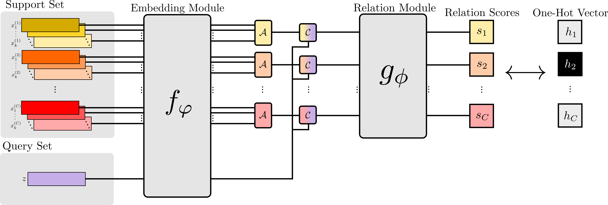

# CS-502 Deep Learning in Biomedicine </br> Enhancing Few-Shot Learning in Biomedicine: Benchmarking Relation Network

## Authors
- 😊 Ozan Güven (297076) - ozan.guven@epfl.ch <br>
- 😄 Arnaud Poletto (302411) - arnaud.poletto@epfl.ch

## Description

The report "*Enhancing Few-Shot Learning in Biomedicine: Benchmarking Relation Network*" investigates the application of the Relation Network, a deep learning model designed for few-shot learning scenarios, in the field of biomedicine. The study focuses on customizing and optimizing the Relation Network for biomedical data analysis, specifically comparing its efficacy against other few-shot learning algorithms. This comparison is crucial for understanding the model’s strengths and areas for improvement within biomedical data analysis. The work involves the use of two key datasets: Tabula Muris and SwissProt, to evaluate the Relation Network's performance in diverse biomedical scenarios.

This repository hosts the code for the experimental implementations of each method, including the Relation Network, and for generating the results reported in our study. Below, you can find a visual representation of the network, as detailed in the [report](./documents/report.pdf).

<p align="center">
    
</p>

## Repository Contents

The repository is structured as follows:

* [📁 backbones](./backbones): Contains code for the backbones used in the experiments.
* [📁 conf](./conf): Contains configuration files for the datasets and the methods used in the experiments.
    * [📁 dataset](./conf/dataset): Contains configuration files for the datasets, namely [📄 swissprot.yaml](./conf/dataset/swissprot.yaml) and [📄 tabula_muris.yaml](./conf/dataset/tabula_muris.yaml).
    * [📁 method](./conf/method): Contains configuration files for the methods. Notably, [📄 relationnet.yaml](./conf/method/relationnet.yaml), the configuration file for the Relation Network.
* [📁 datasets](./datasets): Contains code for loading the datasets used in the experiments.
* [📁 documents](./documents): Contains the [report](./documents/report.pdf).
* [📁 generated](./generated): Contains generated plots and images.
* [📁 methods](./methods): Contains code for the methods used in the experiments. Notably, [📄 relationnet.py](./methods/relationnet.py), the implementation of the Relation Network.
* [📁 notebooks](./notebooks): Contains notebooks used to analyze results and generate plots.
    * [📄 find_best_tuning_results.ipynb](./notebooks/find_best_tuning_results.ipynb): Identifies the best hyperparameter tuning results for the Relation Network for each dataset.
    * [📄 ways_shots_analysis.ipynb](./notebooks/ways_shots_analysis.ipynb): Analyzes the performance of available methods for different number of ways and shots.
* [📁 results](./results): Contains results of the experiments.
    * [📄 hyperparameter_tuning.csv](./results/hyperparameter_tuning.csv): Contains results of the runs for the hyperparameter tuning of the Relation Network.
    * [📄 results.csv](./results/results.csv): Contains results of the runs for both the ablation and the ways and shots analysis of the Relation Network.
* [📁 scripts](./scripts): Contains scripts used to run the experiments.
* [📁 utils](./utils): Contains utility code used in the experiments.
* [📄 run.py](./run.py): Main script used to run the experiments.

## Requirements

### Conda
Create a conda env and install requirements with:
```bash	
conda env create -f environment.yml
```
This command will create a conda environment named `few`, using the requirements specified in the `requirements.txt` file.
Before each run, activate the environment with:

```
conda activate few
```

### Datasets

Tabula Muris will be automatically downloaded when running the experiments. For SwissProt, you need to download the dataset from [here](https://drive.google.com/drive/u/0/folders/1IlyK9_utaiNjlS8RbIXn1aMQ_5vcUy5P). This should be unzipped and put under `./data/swissprot/`.

## Usage

### Training

To run a training procedure with the Relation Network with default parameters, use the following command

```bash
python run.py exp.name=<exp_name> method=<method_name> dataset=<dataset_name>
```
, where `<exp_name>` is the name of the experiment of your choice, `<dataset_name>` is the name of the dataset, either `tabula_muris` or `swissprot` and `<method_name>` is the name of the method. The available methods are:
- `relationnet`: Relation Network.
- `protonet`: Prototypical Network.
- `matchingnet`: Matching Network.
- `maml`: Model-Agnostic Meta-Learning.
- `baseline`: Baseline model.
- `baseline_pp`: Baseline++ model.

For the Relation Network, you can also specify the following parameters:
- `n_way`: Number of classes per episode (i.e. the number of ways).
- `n_shot`: Number of samples per class in the support set (i.e. the number of shots).
- `method.representative_aggregation`: Aggregation method used in the aggregation module $\mathcal{A}$ to compute the representative for each class, when $K > 1$. The options are:
    - `mean`: Mean of the support set.
    - `sum`: Sum of the support set.
- `method.deep_distance_type`: Defines the relation module. The options are:
    - `l1`: L1 distance.
    - `euclidean`: Euclidean distance.
    - `cosine`: Cosine distance.
    - `fc-conc`: Fully connected layer with stacking for the concatenation module $\mathcal{C}$.
    - `fc-diff`: Fully connected layer using the difference for the concatenation module $\mathcal{C}$.
- `method.deep_distance_layer_sizes`: List of layer sizes for the relation module $g_\phi$. This should be given as a string of list of integers, e.g. `"[128, 64, 32, 1]"`. Note that the last layer should always be $1$, as it represents the classification layer.
- `backbone.layer_dim`: List of layer sizes for the embedding module $f_\varphi$. This should be given as a string of list of integers, e.g. `"[16]"`.
- `method.learning_rate`: Learning rate for the training procedure.
- `method.backbone_weight_decay`: Weight decay for the embedding module $f_\varphi$.
- `backbone.dropout`: Dropout rate for the embedding module $f_\varphi$.

The training process will automatically evaluate at the end. To only evaluate without running training, you can add the `mode=test` parameter to the command and it will automatically use the best checkpoint (as measured by val ACC) from the most recent training run with that combination of `exp.name/method/dataset/model`.

To run a training procedure with the Relation Network using the default parameters for the Tabula Muris dataset as stated in the [report](./documents/report.pdf) and found with hyperparameter tuning, use the following command:
```bash
./scripts/run_default_tabula_muris.sh
```

To run a training procedure with the Relation Network using the default parameters for the SwissProt dataset as stated in the [report](./documents/report.pdf) and found with hyperparameter tuning, use the following command:
```bash
./scripts/run_default_swissprot.sh
```

### Hyperparameter Tuning

To run the hyperparameter tuning for the Relation Network for both datasets, run the following command from the root of the repository:

```bash
./scripts/hyperparameter_tuning.sh
```

### Ablation Study

To run the ablation study on the Relation Network for the Tabula Muris dataset, run the following command from the root of the repository:

```bash
./scripts/ablation_tabula_muris.sh
```

To run the ablation study on the Relation Network for the SwissProt dataset, run the following command from the root of the repository:

```bash
./scripts/ablation_swissprot.sh
```

### Ways and Shots Analysis

To run the ways and shots analysis for the Tabula Muris dataset, run the following command from the root of the repository:

```bash
./scripts/ways_shots_tabula_muris.sh
```

To run the ways and shots analysis for the SwissProt dataset, run the following command from the root of the repository:
```bash
./scripts/ways_shots_swissprot.sh
```